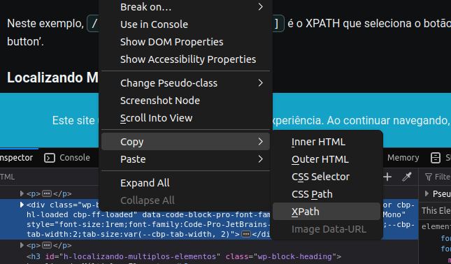
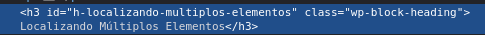

# ROBOTFRAMEWORK CRASHCOURSE
## Sumário
<!--ts-->
- [ROBOTFRAMEWORK CRASHCOURSE](#robotframework-crashcourse)
  - [Sumário](#sumário)
  - [1. Motivação e Apresentação](#1-motivação-e-apresentação)
  - [2. Introdução antes da introdução](#2-introdução-antes-da-introdução)
  - [3. Introdução ao robotframework](#3-introdução-ao-robotframework)
  - [4. Preparação para o uso da library robotframework](#4-preparação-para-o-uso-da-library-robotframework)
  - [5. Programando utilizando o RobotFramework](#5-programando-utilizando-o-robotframework)
    - [Seções](#seções)
    - [Settings](#settings)
      - [Library](#library)
      - [Resource](#resource)
      - [Outros](#outros)
    - [Variables](#variables)
      - [Variáveis Genéricas](#variáveis-genéricas)
      - [xpath](#xpath)
    - [Keywords](#keywords)
    - [Test Cases](#test-cases)
  - [X. Links Importantes](#x-links-importantes)
<!--te-->

## 1. Motivação e Apresentação
Uma versão minha muito resumida da [documentação do robotframework](https://docs.robotframework.org/docs), vista como uma forma de preparar o minimo para o trabalho com testes automatizados.

## 2. Introdução antes da introdução

- **O que é QA?**

*Quality Assurance* significa “Garantia de Qualidade” e garante que a mercadoria seja entregue ao cliente em ótimas condições e com a qualidade esperada por ele. Isso evita que o produto seja entregue com problemas e erros durante o processo.

- **O que eu vou fazer enquanto no QA?**

Testar tudo até achar uma situação em que o código quebra, o professor as vezes pode inventar algumas coisas meio fora da àrea do QA, então pode sempre esperar mais do que só testes.

- **O que tenho que aprender enquanto no QA?** 

Tem muitas coisas para aprender nessa área, muito overlap com áreas diferentes também, você acaba aprendendo um belo básico de frontend, e um belo básico de backend, então é uma área ótima para começar. Existe uma **infinidade** de diferentes [ferramentas](https://roadmap.sh/qa), mas a que eu vou estar introduzindo agora é a **robotframework**, a ferramenta principal de testes do QA.

- **O que são testes automatizados**?

Como o nome já diz, são códigos que simulam o uso de um usuário, assegurando que tudo está ocorrendo como o planejado. No minimo do minimo, testamos apenas se o caminho para executar uma função da aplicação está acessível, no ideal testamos todos os _testcases_.

- **Eu não sei NADA de programação, nasci ontem não tenho git instalado nem ubuntu nem o vscode nem conta no github, o que eu faço?**
1. [Git e Github](./tools/git.md) **!! IMPORTANTÍSSIMO !!**
2. [Python e pip](./tools/python.md) **!! IMPORTANTÍSSIMO !!**
3. [Vscode](./tools/python.md)

- **Eu ODIEI o jeito que você ensina, ODIEI esse repositório, eu tenho ODIO no coração, a brisa do verão É REFRESCANTE DEMAIS, ODEIO suco de manga ser MUITO DOCE, estou com muita raiva. O que eu faço? (Ou se quiser aprofundar mais no robotframework):**
1. [ROBOT FRAMEWORK KICKOFF](https://www.youtube.com/watch?v=wdtqpQrQ598&list=PL5ipcSFH2tk8RWxtvuaOK-qpdAvlWkSoo)
2. [ROBOT FRAMEWORK TUTORIAL - Learn Robot Framework](https://www.youtube.com/playlist?list=PLL34mf651faORDOyJrk0E6k9FM-wKgfPV)
3. [RestAPI Testing using Robot Framework+Python For Beginners](https://www.youtube.com/playlist?list=PLUDwpEzHYYLvMLbma_Rp-6jrrpxkeH0VJ)
4. Se você vem do LASIC, tem ótimos cursos em uma das contas da udemy do laboratório.
## 3. Introdução ao robotframework
```
*** Settings ***
Library  SeleniumLibrary
```
- **O que é o robotframework?**

É, antes de tudo, uma framework de testes, ele junta várias ferramentas de testes automatizados em forma de libraries, unificando-as em uma plataforma de fácil utilização.

O [robotframework](https://robotframework.org/) é muito abstraído, se você alguma vez já se assustou com python por ser uma linguagem que você "só escreve código e ela funciona", robotframework vai te impressionar.

Por ser uma library em cima do python que o torna, de algum jeito, ainda mais simples, pode se esperar que não tem foco em eficiência de processamento de código assim como outras linguagens. Você vai ver isso em algumas organizações de projeto, como a que vou explicar aqui.

Ele junta ferramentas como:
- [playwright](https://playwright.dev/)
- [appium](https://appium.io/)
- [selenium](https://www.selenium.dev/)
- e muitas outras!

## 4. Preparação para o uso da library robotframework

- É bom ver o crash course também de [python](/tools/python.md) e depois o de [git](/tools/git.md). Mas no geral, para iniciar um novo projeto em robotframework, você segue o início básico de todo projeto em python:

Para Linux:
1. Crie um venv com `python3 -m venv venv`
2. Acesse o venv com `source venv/bin/activate`
3. Baixe suas dependências com o pip: `pip install robotframework robotframework-seleniumlibrary`... e outras dependências

Para Windows
1. Crie um venv com `python3 -m venv venv`
2. Acesse o venv com `venv/Scripts/activate` (talvez tenha que permitir scripts com o comando `Set-ExecutionPolicy RemoteSigned`, se você se sente inseguro, pode usar também `Set-ExecutionPolicy Restricted` para retornar ao estado mais protetivo do windows)
3. Baixe suas dependências com o pip: `pip install robotframework robotframework-seleniumlibrary`... e outras dependências

- O Vscode possuí um syntax highlight básico de robotframework, mas para mais compatíbilidade uma extensão muito boa para trabalhar com robotframework é essa:


- Para testes de Front-end, vamos utilizar Selenium como a base para os testes, então precisamos dos Webdrivers para os browsers que vamos testar:
Já existem videos melhores ensinando a instalar essas dependencias. Recomendo esses:
- [Selenium com Python #01b - Configurando seu ambiente no Linux](https://youtu.be/XUeu4ZzQNUI?si=N6j4wDU0troRTsXg)
- [Selenium com Python #01a - Configurando seu ambiente no Windows](https://youtu.be/rVCKZcFHu4A?si=QMCcHNdDhce5rvLB)
  
O que você precisa principalmente são as versões de teste do browser e seus WebDrivers, um site bom que ensina a instalar versões de teste do Google Chrome é:
- [Chrome for Testing: reliable downloads for browser automation](https://developer.chrome.com/blog/chrome-for-testing) (Você pode encontrar os comandos no fundo da página

Depois disso tudo, a documentação do robotframework é sua maior amiga:
- [Robotframework](https://robotframework.org/)
- [Builtin (Library Padrão)](https://robotframework.org/robotframework/latest/libraries/BuiltIn.html)
- [Selenium Library](https://robotframework.org/SeleniumLibrary/SeleniumLibrary.html)
- [Requests Library](https://docs.robotframework.org/docs/different_libraries/requests)

Leia mais: [I'm looking for testing](https://docs.robotframework.org/docs/getting_started/testing)

## 5. Programando utilizando o RobotFramework
Finalmente podemos ir para a parte interessante! Sendo uma library focada em suites para testes, o robotframework é bem direto e enxuto, seu código é escrito:


Vamos tentar entender esse exemplo:

Primeiro o que percebemos é a divisão do código em partes.

### Seções

Arquivos .robot são dividios em 4 partes principais:
- `*** Settings ***`, onde ficam as importações e outras configurações importantes
- `*** Variables ***`, onde ficam as declarações de variáveis, como xpaths, valores, nomes, atributos, etc.
- `*** Keywords ***`, onde ficam as declarações de keywords, que são as funções em robotframework.
- `*** Test Cases ***`, onde ficam as funções main da nossa automação, será o lugar onde ficam os códigos que serão rodados.

Também possuí:
- Tasks: Para uso de RPA
- Comments: Para comentários
- Documentation: Para documentação

### Settings

#### Library
- Quando baixada uma library, ou criada uma [library customizada em python](https://docs.robotframework.org/docs/extending_robot_framework/custom-libraries/python_library), importamos dentro da sessão de Settings:

`Library    SeleniumLibrary`
#### Resource
- Como vou demonstrar mais tarde, suas automatizações serão separadas em suítes de teste (onde os testes acontecem) e em arquivos resource (arquivos de variáveis e keywords).
- Suítes de teste são salvas com a extensão `.robot` e arquivos de resource devem ser salvos com `.resource`. A regra não é necessária para arquivos resource, mas necessária para suítes, busque seguir o formato.
- Resources são chamados com
`Resource   keywords/caminho/para/o/arquivo.resource`

#### Outros
Existem outras àreas interessantes na settings, como:
- `Setup     keyword de setup`: Roda uma keyword de setup antes de todo testcase. Pode ser algo como "abrir navegador e fazer login"
- `Teardown  keyword de teardown` Roda uma keyword de teardown depois de todo testcase. Pode ser algo como "fechar navegador"

### Variables

#### Variáveis Genéricas

Variáveis serão salvas da seguinte forma:

- `${NOME_DA_VARIÁVEL}      valor da variável`

O nome da variável é uma das poucas coisas que não deve ter espaços, enquanto a variável é automaticamente reconhecida como uma string ou integer dependendo do seu formato. Assim como em python, robotframework tem tipos dinamicos.

#### xpath

[Xpath](https://hub.asimov.academy/tutorial/localizar-elementos-com-xpath-em-selenium/) são "caminhos para elementos", em qualquer formatação de texto orientada a elementos, como em html, xpath pode ser usado para selecionar um distinto valor.

Um jeito fácil, mas não recomendado e muito bagunçado de fabricar um xpath é copiando diretamente do inspecionar elemento do seu navegador



- Porém isso não é recomendado, pois o navegador copiará toda a estrutura do html até aquele elemento. Existem formas melhores.

- O padrão do xpath que vamos utilizar é:
`//tipodeelemento[@identificador="valor"]`

Por exemplo, esse seria um botão de like de um site imaginário:

`//button[@class='like-button']`

Ou ainda, em um caso mais real:



Um xpath possível para esse elemento apresentado seria:
`//h3[@class='wp-block-heading']`,
Poderiamos usar também o id como identificador.

**E se eu quiser achar o filho de um elemento?**

Podemos escrever:

`//xpathdopai//xpathdofilho`

e então esse xpath apontaria para o xpath do filho.

### Keywords

Keywords são os blocos de construção da sua automação, elas juntam outras keywords em blocos reutilizáveis, deixando seu código mais legível e expansível.

**Declaração de keywords**

O formato padrão da declaração de uma keyword seria:

```
Login User
    [Arguments]    ${login}    ${password}
    Set Login Name    ${login}
    Set Password    ${password}
    Execute Login
```

Em que `Login User` é uma keyword com argumentos `login` e `passwords`.

### Test Cases

[MAIS PARA VIR]

## X. Links Importantes
